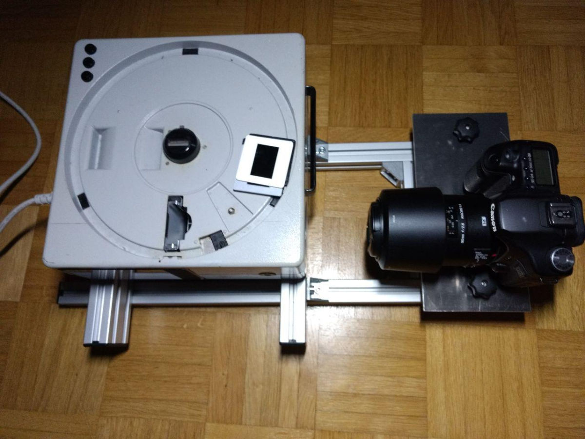
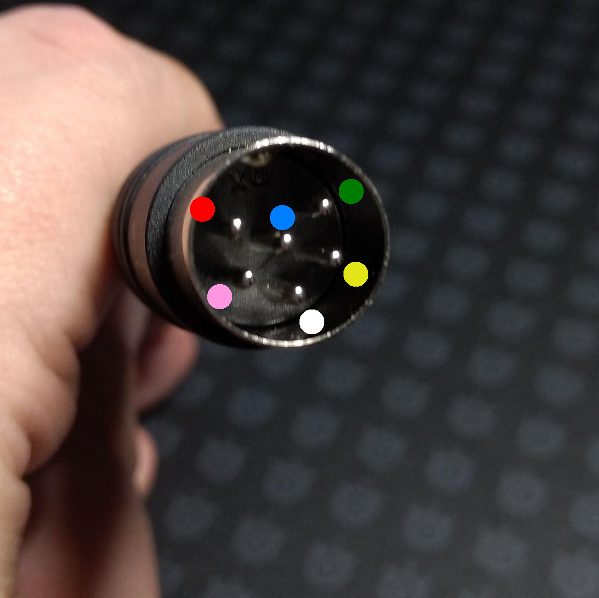
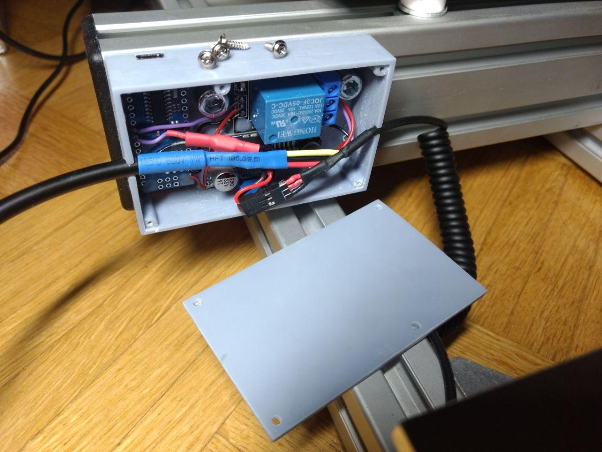

# Slide Cam Remote
Automatically trigger a slide projector and a DSLR to mass-capture analog slides.



## Equipment
* Canon 50D
* Tamron 90mm F/2.8 1:1 macro lens
* Kodak Carousel S Slide Projector
* Arduino Pro Mini
My camera produces the sharpest images when using *F/9.1*

## Arduino Code
The code allows confiruration via serial port via
* `p`rojector delay (min 500ms)
* `s`hutter delay (min 50ms)
* shutter `c`ount 
* `r`epeat sequence (default 80 for Carousel Projector)

## Shutter Cable
https://www.amazon.de/gp/product/B0079WLI3A/
* weiss = Focus
* gelb = gnd
* red = shutter

## Projector Pinout
https://www.vintage-radio.net/forum/showpost.php?p=1180549&postcount=4
* 1: change reverse
* 2: change forwards
* 3: +ve supply
* 4: focus motor
* 5: focus motor
* 6: -ve supply

### Projector side:
```
  _____ _____ 
 /           \
/  5       1  \
|      6      |
|  4       2  |
\      3      /
 \___________/
```
## Cable Pinout
https://www.amazon.de/gp/product/B01CQN21L4/
* 1: Red
* 2: Pink (fwd - connect to + for action)
* 3: White (+)
* 4: Yellow
* 5: Green
* 6: Blue (-)



## Schematic



